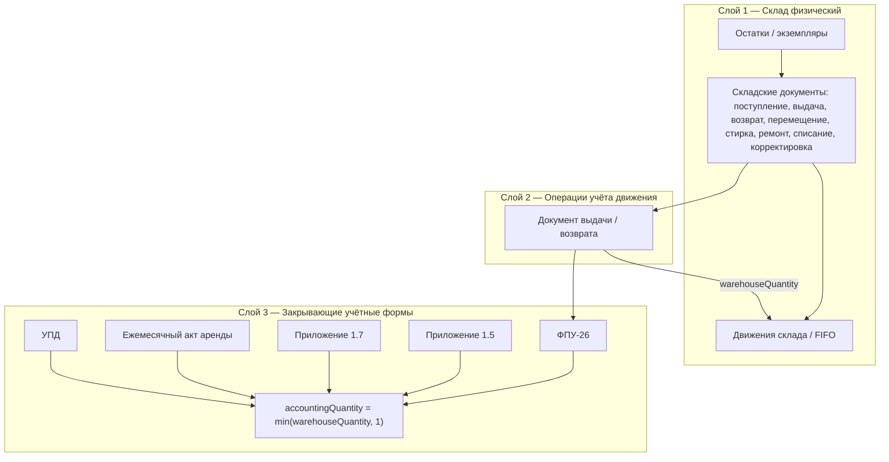

# ТЗ для следующих моделей: разделение склада и учётных документов, НДС с округлением вниз

Дата фиксации требований: **22.08.2026**.

Этот файл — **единая точка входа** для двух связанных доработок. Перед началом работы модель должна прочитать `HANDOFF.md`, затем этот файл, `docs/architecture.md`, `docs/CUSTOMER_DECISIONS.md`, проверить `git status` и сохранить все существующие незакоммиченные изменения. Не начинать проект заново и не переписывать уже работающие модули без необходимости.

Ориентиры по стилю и структуре релизов: `docs/TZ_NEXT_RELEASES_2026-08-19.md`, `docs/TZ_RELEASES_THREE_PC_BACKUP_2026-08-21.md`.

---

## 0. Краткая суть для быстрой ориентации

| Тема | Суть |
|------|------|
| **Релиз У — склад vs учёт** | Склад оперирует **реальным количеством** (экземпляры, FIFO, движения). Закрывающие учётные формы оперируют **учётным количеством = 1 на каждую позицию**, даже если со склада выдано 2 и более. |
| **Релиз Ф — НДС** | В номенклатуре вводится **цена без НДС**. К ней **начисляется НДС сверху**. Все денежные суммы для учёта и печати округляются **до копеек (сотых) в меньшую сторону** (`floor`). Пример: 100,00 ₽ + 5% НДС = **105,00 ₽**. |

Релизы выполнять **последовательно: У → Ф**. Не смешивать в одном коммите.

---

## 1. Общие правила реализации

- Программа работает в одной локальной сети; публичного облачного развёртывания не требуется.
- Все изменения схемы БД — **только новой миграцией**. Не редактировать применённые миграции.
- Сервер сохраняет слои `routes → controller → service → repository`; бизнес-логику в routes не добавлять.
- Экран, Excel и PDF одной формы должны использовать **один и тот же backend-расчёт** — дублировать формулы на клиенте запрещено.
- После каждого релиза: `git diff --check`, тесты затронутого модуля, `pnpm lint`, `pnpm format:check`, сборка клиента. Перед передачей — полный `pnpm release:check`.
- Один самостоятельный коммит на релиз.
- После успешной приёмки обновить `HANDOFF.md`, при необходимости `docs/USER_GUIDE.md` и `docs/CUSTOMER_DECISIONS.md`.

---

## 2. Три слоя системы (целевая модель)

Сейчас часть модулей смешивает физическое и учётное количество. Цель — явное разделение без дублирования данных.



### 2.1. Слой 1 — Склад (физический)

**Назначение:** отражать реальные штуки на складе и у работника.

- Единица учёта — **экземпляр** (`Instance`) с инвентарным номером, статусом, складом.
- Количество в строке складского документа (`IssuanceLine.quantity`, `ReceivingLine.quantity` и т.д.) — **фактическое число списываемых/оприходуемых единиц**.
- Проведение документа создаёт/перемещает экземпляры и движения **в количестве, указанном в документе**.
- Частичная нехватка остатка при проведении выдачи (нужно 2, на складе 1) — **существующее поведение сохраняется**: проводится 1, создаётся задача на довыдачу остатка.

**Не менять:** логику FIFO, блокировку при проведении, задачи на доукомплектовку, «Задание на сборку» (`assembly-order`).

### 2.2. Слой 2 — Операционные документы

**Назначение:** юридически значимый факт выдачи/возврата с привязкой к работнику, складу, ценовому снимку.

- Документ выдачи хранит **складское количество** в строке.
- Ценовой снимок на строке (`priceWithoutVatSnapshot`, `vatRateSnapshot`, `priceWithVatSnapshot`) фиксируется при проведении — **как сейчас** (релиз 12).
- Сохранная расписка (`preservation-receipt`) и задание на сборку показывают **складское** количество — это внутренние/подтверждающие формы, не закрывающий учёт.

### 2.3. Слой 3 — Закрывающие учётные формы

**Назначение:** договорные и бухгалтерские документы для РЖД (ФПУ-26, приложения 1.5/1.7, ежемесячный акт, УПД).

**Ключевое правило (новое):**

> Для **каждой позиции** (строки номенклатуры в периоде/документе) в учётные формы попадает **не более 1 единицы**, независимо от того, сколько физически выдано со склада.

**Пример (обязательный контрольный сценарий):**

| Где | Модель «Куртка», размер 48 | Количество |
|-----|----------------------------|------------|
| Документ выдачи (склад) | Куртка 48 | **2** |
| Экземпляры у работника после проведения | 2 инв. номера | **2** |
| ФПУ-26 / Прил. 1.5 / Прил. 1.7 / УПД за период | Куртка 48 | **1** |
| Ежемесячный акт аренды | одна строка на экземпляр | **1 строка на экземпляр** (без изменений) |

Правило **«1 на позицию»** означает: для агрегированных форм (ФПУ, 1.5, 1.7, УПД) при группировке по модели/цене/должности в колонку «Кол-во» попадает **`min(сумма складских количеств, 1)`**, а не сумма всех выдач.

**Исключения — формы, где количество остаётся физическим:**

| Форма | Количество |
|-------|------------|
| Задание на сборку | складское |
| Сохранная расписка | складское |
| Личная карточка | 1 на экземпляр (уже так: `quantity: 1`, `issuedQuantity: 1`) |
| Ежемeсячный акт аренды | 1 строка = 1 экземпляр; расчёт по дням аренды |

---

## 3. Текущее состояние кода (gap analysis)

Модель должна сверить это с актуальным кодом перед правками.

| Место | Сейчас | Нужно |
|-------|--------|-------|
| `appendix-1-5.builder.js` | `row.quantity += line.quantity` | учётное количество с cap 1 |
| `appendix-1-7.builder.js` | `quantity = line.quantity` | `min(line.quantity, 1)` для live-строк |
| `fpu-26.builder.js` | `row.quantity += quantity` из выдачи | cap 1 на группу |
| `upd.builder.js` | берёт `candidate.quantity` / `row.quantity` | cap 1 |
| `personal-card.builder.js` | уже `quantity: 1` | без изменений |
| `monthly-rental-act.service.js` | строка на экземпляр | без изменений по количеству |
| `money.js` → `calculateMoney` | `toFixed(9)`, без floor | floor до 2 знаков (релиз Ф) |
| `monthly-rental-act.service.js` → `round` | `toFixed(4)` | заменить на единый `floorMoney` (релиз Ф) |
| Карточка номенклатуры | «Цена аренды за месяц **без НДС**» + `rentalVatRate` | подтвердить UX; расчёт по релизу Ф |
| `CUSTOMER_DECISIONS.md` п.9 | неоднозначность «цена с/без НДС» | **закрыть** решением: цена **без НДС**, НДС сверху |

---

# Релиз У. Разделение складского и учётного количества

## У1. Цель

Исключить ситуацию, когда закрывающая форма показывает «2 шт.», хотя по договору учёт ведётся как **1 комплектная позиция**, а второй физический экземпляр — запас/ротация на складе работника.

## У2. Термины (зафиксировать в коде и комментариях)

- `warehouseQuantity` — количество в строке складского документа / число экземпляров / сумма в задании на сборку.
- `accountingQuantity` — количество для закрывающих форм:

```text
accountingQuantity = min(warehouseQuantity, 1)
```

Для целых положительных количеств из системы это всегда `1`, если `warehouseQuantity >= 1`, и `0`, если строки нет.

**Не путать** с нормой комплекта (`PositionKitItem.quantity`, `normQuantity` в личной карточке) — это справочная норма должности, не драйвер закрывающих форм.

## У3. Область применения `accountingQuantity`

Применять при построении данных (builder/service) для:

1. **ФПУ-26** — `server/src/modules/print-forms/fpu-26/fpu-26.builder.js`
2. **Приложение 1.5** — `appendix-1-5/appendix-1-5.builder.js`
3. **Приложение 1.7** — `appendix-1-7/appendix-1-7.builder.js`
4. **УПД** — `upd/upd.builder.js`

**Не применять** к:

- проведению выдачи, движениям, остаткам;
- сохранной расписке, заданию на сборку;
- личной карточке;
- ежемесячному акту аренды (там учёт по экземплярам).

## У4. Реализация

### У4.1. Общая функция

Добавить в `server/src/modules/print-forms/shared/money.js` (или отдельный `quantities.js` рядом, если файл раздувается):

```javascript
export function warehouseQuantity(value) {
  return Math.max(0, Math.trunc(Number(value ?? 0)));
}

export function accountingQuantity(value) {
  const qty = warehouseQuantity(value);
  return qty > 0 ? 1 : 0;
}
```

Использовать **только** в builder'ах закрывающих форм. Не подменять `line.quantity` в БД и не менять складские сервисы.

### У4.2. Агрегированные формы (ФПУ, 1.5)

При суммировании нескольких выдач одной модели за период:

```text
// Неверно (сейчас):
group.quantity += line.quantity;

// Верно:
group.accountingQuantity = 1; // после первой ненулевой выдачи позиции в группе
```

Если в группировке несколько документов выдали одну и ту же модель по одной цене, **учётное количество остаётся 1**, а не 2.

Для **Приложения 1.5** поле `coverageDays` **не менять** — оно считается по работникам/дням обеспечения, не по складскому количеству.

### У4.3. Приложение 1.7

Live-строки: в колонку «Кол-во» — `accountingQuantity(line.quantity)`.

Инвентарные номера в строке по-прежнему можно перечислять все физические (`instances.map(...).join(', ')`), но **суммы** считаются от `accountingQuantity = 1`.

### У4.4. Архивные строки импорта

Архивные кандидаты с `quantity > 1` в закрывающих формах также приводятся к **`accountingQuantity`**, чтобы live и archive вели себя одинаково.

Исключение: если архивная строка явно хранит **уже пересчитанные итоги** (`subtotalWithoutVat`, `vatAmount`, `totalWithVat` с флагом `sourceValues`) — **не пересчитывать** суммы при миграции истории; только новые генерации после релиза.

### У4.5. UI / API

- В редакторе выдачи количество **не ограничивать** единицей — кладовщик по-прежнему указывает реальное складское количество.
- Опционально (не блокирует релиз): подсказка в редакторе выдачи для бухгалтера «В закрывающих формах по этой позиции будет учтена 1 ед.»

## У5. Тесты

Добавить/расширить:

| Файл | Сценарий |
|------|----------|
| `print-forms-fpu-26.test.js` | Выдача qty=2 → в ФПУ колонка количества = 1, суммы от 1 |
| `print-forms-appendix-1-7.test.js` (или общий) | qty=2 → кол-во 1, два инв. номера в тексте |
| `print-forms-appendix-1-5.test.js` | Две выдачи одной модели → qty=1, coverageDays не сломан |
| `print-forms-upd.test.js` | qty=2 → qty=1 |
| `issuance.test.js` | **без изменений** складского qty=2 после проведения |

Контрольный интеграционный сценарий:

1. Создать выдачу: 1 модель, qty=2, провести — на работнике 2 экземпляра.
2. Сформировать ФПУ и 1.7 за период — количество **1**, стоимость **за 1 ед.** (до релиза Ф — по старым правилам округления).
3. Сформировать задание на сборку — количество **2**.

## У6. Критерии приёмки

- [ ] Складские остатки и число экземпляров у работника соответствуют **складскому** количеству.
- [ ] ФПУ-26, 1.5, 1.7, УПД показывают **не более 1** в колонке количества на позицию.
- [ ] Задание на сборку и сохранная расписка показывают **фактическое** количество.
- [ ] Ежемесячный акт и личная карточка работают как до релиза.
- [ ] Excel и PDF совпадают с backend-preview.
- [ ] Существующие тесты склада зелёные.

---

# Релиз Ф. НДС: цена без налога, начисление сверху, округление вниз до копеек

## Ф1. Цель

Зафиксировать однозначное правило НДС для номенклатуры и **всех** денежных расчётов в закрывающих формах и ежемесячном акте:

1. Пользователь вводит **цену без НДС** (как сейчас в поле «Цена аренды за месяц без НДС»).
2. **НДС начисляется сверху** по ставке из номенклатуры (`rentalVatRate`, по умолчанию 5%).
3. Каждая денежная величина округляется **до 2 знаков после запятой в меньшую сторону** (toward zero floor для положительных сумм).

**Базовый пример (обязателен в тестах):**

```text
priceWithoutVat = 100.00
vatRate = 5%
vatAmount       = floor2(100.00 × 5 / 100) = 5.00
priceWithVat    = floor2(100.00 + 5.00)   = 105.00
```

**Пример с «ломаными» копейками:**

```text
priceWithoutVat = 33.33
vatRate = 5%
vatAmount       = floor2(33.33 × 0.05) = floor2(1.6665) = 1.66
priceWithVat    = 33.33 + 1.66 = 35.00  (или floor2(33.33 × 1.05) = 34.99 — см. Ф3)
```

## Ф2. Решение заказчика (закрыть неоднозначность п.9 CUSTOMER_DECISIONS)

Зафиксировать в `docs/CUSTOMER_DECISIONS.md`:

- В номенклатуре хранится **цена без НДС**.
- **НДС начисляется сверху**, не выделяется из gross-цены.
- Вариант «цена уже с НДС» **не используется** в текущем договорном контуре.

До отдельного решения заказчика **не добавлять** переключатель «цена с НДС» в UI.

## Ф3. Единая функция округления

Заменить разрозненные `round`/`money` для **учётных сумм**:

```javascript
export function floorMoney(value) {
  const n = Number(value ?? 0);
  if (!Number.isFinite(n)) return 0;
  return Math.floor(n * 100) / 100;
}
```

**Порядок расчёта строки** (quantity = учётное или физическое — по контексту формы):

```text
costWithoutVat = floor2(quantity × priceWithoutVat)
vatAmount      = floor2(costWithoutVat × vatRate / 100)
totalWithVat   = floor2(costWithoutVat + vatAmount)
priceWithVat   = floor2(priceWithoutVat × (1 + vatRate / 100))   // для колонки «цена с НДС»
```

**Важно:**

- Округление **на каждом шаге**, не только в конце.
- Итог по документу = **сумма уже округлённых строк**, а не округление от безошибочной суммы.
- Для отображения в Excel использовать числовой формат `#,##0.00` в закрывающих формах (вместо `#,##0.0000`), если заказчик не потребует 4 знака отдельным решением.

## Ф4. Область применения floorMoney

Обновить расчёты в:

| Модуль | Файл |
|--------|------|
| Общий расчёт | `print-forms/shared/money.js` → `calculateMoney`, `money`, `priceValues` |
| Ежемесячный акт | `monthly-rental-act.service.js` — заменить локальный `round` (4 знака) |
| ФПУ-26 | builder + excel-mapper |
| Приложения 1.5 / 1.7 | builder + excel-mapper |
| УПД | builder + pdf-mapper |
| Снимок цены в выдаче | `issuance.service.js` → `buildPriceSnapshot` — snapshots тоже floor2 |
| Стартовый импорт | при необходимости синхронизировать пересчёт НДС |

**Не трогать** без необходимости:

- закупочную цену поступления (другой контур);
- `ru-format.js` (пропись сумм) — проверить согласованность с floor2 в тестах.

## Ф5. Номенклатура и ставка НДС

- Поле `rentalPrice` — **без НДС**, `DECIMAL(14, 4)` в БД допускает ввод, но **в расчёт и печать** идёт значение после `floorMoney` на уровне цены за единицу **или** на уровне произведения — единообразно через `calculateMoney`.
- Поле `rentalVatRate` — проценты, по умолчанию `5`.
- Исторический справочник `nomenclature_prices` — при выборе цены для снимка выдачи применять те же правила floor2.

Подписи в UI (`NomenclatureModelsPage.jsx`) оставить явными: «без НДС».

## Ф6. Ежемесячный акт аренды

Формула неполного месяца **не меняется**:

```text
costWithoutVat = floor2(monthlyPriceWithoutVat × rentalDays / daysInMonth)
vatAmount      = floor2(costWithoutVat × vatRate / 100)
totalWithVat   = floor2(costWithoutVat + vatAmount)
```

Пересчитать ожидаемые суммы в тестах (сейчас округление до 4 знаков — будет отличаться на тысячные/десятитысячные доли; после floor2 возможны отличия на копейки).

## Ф7. Зафиксированные акты

- Уже сохранённые версии `MonthlyRentalActVersion` с бинарными Excel/PDF **не переписывать автоматически**.
- Новые генерации и пересчёт preview после `flagStale` используют новые правила.
- Аналогично для архивных строк с `sourceValues: true`.

## Ф8. Тесты

| Тест | Проверка |
|------|----------|
| Unit `money.test.js` (новый) | 100×5%=105; 33.33×5%; floor на границе 1.005 |
| `print-forms-monthly-rental-act.test.js` | обновить ожидаемые totals под floor2 |
| `print-forms-fpu-26.test.js` | сумма НДС и итог с floor2 |
| `print-forms-appendix-1-7.test.js` | kol-vo × cena с floor2 |
| `issuance-revise.test.js` | снимок цены с floor2 |
| `startup-import-parser.test.js` | импорт цены и ставки |

## Ф9. Критерии приёмки

- [ ] 100 ₽ + 5% = **105,00 ₽** во всех формах.
- [ ] Ни одна учётная сумма не округляется **вверх** (проверка property-тестом или таблицей граничных значений).
- [ ] Excel = PDF = JSON preview для каждой затронутой формы.
- [ ] `CUSTOMER_DECISIONS.md` п.9 помечен как **решённый**.
- [ ] Документация пользователя описывает правило в одном абзаце.

---

## 4. Порядок работ и зависимости

```text
Релиз У (accountingQuantity)
    ↓
Релиз Ф (floorMoney + НДС)
    ↓
pnpm release:check
    ↓
Обновление HANDOFF.md
```

Релиз Ф **логически опирается** на У (суммы в формах считаются от учётного количества), но при срочности можно начать Ф с quantity=1 в тестах, если У ещё не готов — **не рекомендуется**.

---

## 5. Карта файлов (ориентир для поиска)

```
server/src/modules/print-forms/shared/money.js          — calculateMoney, floorMoney, accountingQuantity
server/src/modules/print-forms/fpu-26/
server/src/modules/print-forms/appendix-1-5/
server/src/modules/print-forms/appendix-1-7/
server/src/modules/print-forms/upd/
server/src/modules/print-forms/monthly-rental-act/monthly-rental-act.service.js
server/src/modules/issuance/documents/issuance.service.js — price snapshot
server/src/tests/print-forms-*.test.js
client/src/pages/nomenclature/NomenclatureModelsPage.jsx — подписи полей
docs/CUSTOMER_DECISIONS.md
docs/USER_GUIDE.md
HANDOFF.md
```

Шаблоны Excel/PDF лежат в bundle-миграциях (`0066`, `0079`) и каталогах `server/src/modules/print-forms/*/`. Маркеры колонок — в `print_form_templates`. **Менять координаты шаблонов только если меняется число колонок**; смена 4→2 знака — формат ячеек, не структура.

---

## 6. Вопросы заказчику (не блокируют старт У и Ф)

1. Если по одной модели в комплекте положены **2 единицы по норме** (например 2 пары перчаток), правило «max 1 в закрывающих формах» всё равно применяется? **В этом ТЗ — да**, пока заказчик не уточнит исключения по видам номенклатуры.
2. Нужно ли показывать бухгалтеру в UI обе цифры: «Со склада: 2 / В учёт: 1»? Рекомендация: **да**, но отдельным небольшим улучшением после релиза У.
3. Ставка НДС всегда 5% или нужен справочник ставок? Сейчас — **поле на модели**, default 5%.

---

## 7. Финальная проверка серии

- [ ] Миграции не требуются для У; для Ф — только если меняется тип/комментарий полей (ожидается **без** миграции).
- [ ] Выдача qty=2 → 2 экземпляра на работнике, 1 в ФПУ/1.7/1.5/УПД.
- [ ] 100 + 5% НДС = 105,00 ₽ везде.
- [ ] `pnpm release:check` зелёный.
- [ ] `HANDOFF.md` обновлён: следующая задача — установка на сервер / иные согласованные релизы.
